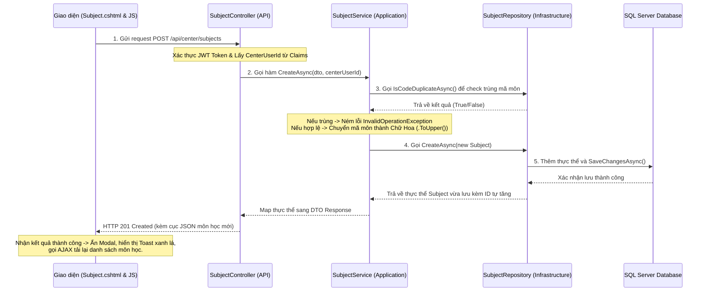
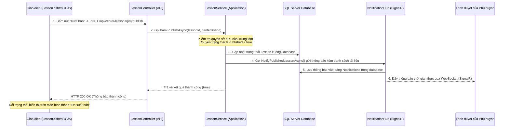
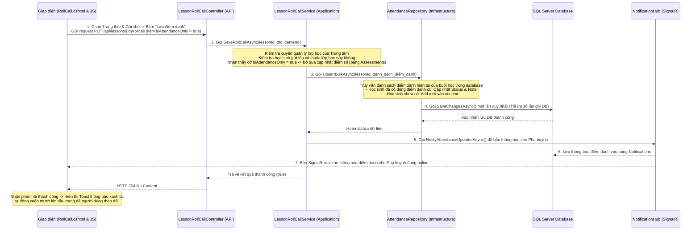

# HƯỚNG DẪN BÁO VỆ ĐỒ ÁN MÔN PRN232 (C# & .NET)
## Dành cho Thành viên 4: Subject (Môn học) + Lesson (Buổi học) + Material (Tài liệu) + Attendance (Điểm danh)

Tài liệu này tổng hợp toàn bộ kiến thức chuyên môn, luồng đi của dữ liệu (Data Flow) và cấu trúc mã nguồn của **Người 4** theo đúng chuẩn học phần môn **PRN232 (C# và ASP.NET Core)**. Tài liệu bao gồm kiến trúc phân tầng, chi tiết API, các Class C#, sơ đồ luồng dữ liệu Mermaid và các tình huống phản biện thực tế trước Hội đồng bảo vệ.

---

## 1. Kiến trúc phân tầng của Dự án (Architecture Layers)
Dự án được xây dựng theo mô hình **Layered Architecture (Kiến trúc phân tầng)** phân tách rõ ràng trách nhiệm giữa các Layer:

*   **PROJECT_PRN232_.Domain**: Chứa các Entity lớp thực thể ánh xạ vào database thông qua EF Core (`Subject`, `Lesson`, `Material`, `Attendance`) và các Enum (`AttendanceStatus`). Layer này độc lập tuyệt đối và không phụ thuộc vào thư viện ngoài.
*   **PROJECT_PRN232_.Infrastructure**: Chứa DbContext (`AppDbContext`) và triển khai các Repository truy vấn LINQ/SQL (`SubjectRepository`, `LessonRepository`, `MaterialRepository`, `AttendanceRepository`).
*   **PROJECT_PRN232_.Application**: Chứa tầng logic xử lý nghiệp vụ (Business Logic), các interface Service (`ISubjectService`, `ILessonService`, `IMaterialService`, `IAttendanceService`, `ILessonRollCallService`) và các **DTO (Data Transfer Object)** đóng gói dữ liệu truyền tải.
*   **PROJECT_PRN232_.Api**: Chứa các API Controller (`SubjectController`, `LessonController`, `MaterialController`, `AttendanceController`, `LessonRollCallController`) cung cấp đầu endpoint JSON cho Client.
*   **PROJECT_PRN232_.WebApp**: Chứa giao diện Razor Pages (`Subject.cshtml`, `Lesson.cshtml`, `Materials.cshtml`, `RollCall.cshtml`, `Attendance.cshtml`) và các file JS tương tác qua AJAX.

---

## 2. Chi tiết luồng và mã nguồn từng chức năng

### 2.1. Quản lý Môn học (Subject)
Mô-đun quản lý danh mục môn học của trung tâm (Mã môn, tên môn, số buổi học).

#### Luồng đi của dữ liệu (Create Subject Flow):
1. **Frontend (Browser)**: Người dùng nhập thông tin môn học $\rightarrow$ Bấm "Tạo môn học" $\rightarrow$ `subjects.js` chặn hành vi reload mặc định và gửi request `POST` qua fetch API tới `/api/center/subjects`.
2. **API Controller**: `SubjectController.cs` nhận request, giải mã JSON thành DTO `SubjectCreateDto`. Nó trích xuất `CenterId` từ Claims của User đang đăng nhập, rồi gọi `_subjectService.CreateAsync(...)`.
3. **Application Service**: `SubjectService.cs` xử lý nghiệp vụ:
    *   Gọi `IsCodeDuplicateAsync` qua Repository để kiểm tra mã môn học xem có bị trùng trong cùng một trung tâm hay không. Nếu trùng $\rightarrow$ Ném lỗi `InvalidOperationException`.
    *   Nếu hợp lệ, chuẩn hóa viết hoa mã môn (`SubjectCode.ToUpper()`), rồi gọi `_subjectRepository.CreateAsync(subject)`.
4. **Infrastructure Repository**: `SubjectRepository.cs` thực hiện thêm mới vào database qua EF Core (`_context.Subjects.Add`) và `SaveChangesAsync()`.
5. **Phản hồi**: Trả về HTTP 201 Created kèm dữ liệu môn học vừa tạo. JavaScript nhận kết quả, ẩn Modal, hiển thị Toast thành công và gọi AJAX tải lại danh sách.

#### Chi tiết Code C# Backend cho Môn học (Subject):
* **Kiểm tra trùng mã môn và Tạo mới (Service)**: Xem tại [SubjectService.cs:CreateAsync](file:///c:/SU26/PRN232/ProjectPRN/PRN232_Gr3/src/PROJECT_PRN232_.Application/Services/SubjectService.cs#L37-L58)
```csharp
public async Task<SubjectResponseDto> CreateAsync(SubjectCreateDto dto, int centerUserId)
{
    var isDuplicate = await _subjectRepository.IsCodeDuplicateAsync(centerUserId, dto.SubjectCode.Trim());
    if (isDuplicate)
    {
        throw new InvalidOperationException($"Mã môn học '{dto.SubjectCode}' đã tồn tại trong trung tâm của bạn.");
    }

    var subject = new Subject
    {
        CenterId = centerUserId,
        SubjectCode = dto.SubjectCode.Trim().ToUpper(),
        SubjectName = dto.SubjectName.Trim(),
        Description = dto.Description?.Trim(),
        NumberOfSessions = dto.NumberOfSessions,
        CreatedAt = DateTime.Now
    };

    var created = await _subjectRepository.CreateAsync(subject);
    return MapToDto(created);
}
```
* **Xóa cascade liên kết tài liệu để tránh lỗi khóa ngoại (Repository)**: Xem tại [SubjectRepository.cs:DeleteAsync](file:///c:/SU26/PRN232/ProjectPRN/PRN232_Gr3/src/PROJECT_PRN232_.Infrastructure/Repositories/SubjectRepository.cs#L70-L83)
```csharp
public async Task<bool> DeleteAsync(int subjectId)
{
    var subject = await _context.Subjects
        .Include(s => s.Materials)
        .FirstOrDefaultAsync(s => s.Id == subjectId);

    if (subject == null) return false;

    _context.Materials.RemoveRange(subject.Materials); // Xóa toàn bộ tài liệu thuộc môn học trước
    _context.Subjects.Remove(subject);
    await _context.SaveChangesAsync();
    return true;
}
```


#### Sơ đồ luồng:


---

### 2.2. Quản lý Buổi học (Lesson / Session)
Quản lý các buổi học chi tiết của từng lớp, bao gồm phòng học (`Room`), ca học (`Slot`) và trạng thái xuất bản (`IsPublished`).

#### Giai đoạn 1: Khởi tạo các Buổi học (Có 2 cơ chế chính)

##### Cơ chế A: Tự động sinh hàng loạt theo Lịch học khi Tạo/Cập nhật Lớp học (Luồng chính)
1. **Frontend**: Tại màn hình Tạo lớp học, Trung tâm chọn **Phòng học (`Room`)**, **Tổng số buổi học (`TotalLessons` - thường mặc định là 24)** và **Lịch học** (Ví dụ: Thứ 2 ca 2 + Thứ 4 ca 3) $\rightarrow$ Gửi request `POST /api/center/classes`.
2. **Kiểm tra trùng phòng học**: Trong [CenterClassController.cs](file:///c:/SU26/PRN232/ProjectPRN/PRN232_Gr3/src/PROJECT_PRN232_.Api/Controllers/CenterClassController.cs), hệ thống sẽ tính toán trước ngày diễn ra của toàn bộ `TotalLessons` buổi học dựa vào lịch học. Sau đó chạy truy vấn kiểm tra xem phòng học có bị trùng lịch vào các ngày và ca đó với lớp khác không. Nếu đụng $\rightarrow$ Trả về lỗi chặn ngay lập tức.
3. **Sinh buổi học tự động**: Nếu hợp lệ, hệ thống tạo lớp học thành công và chạy vòng lặp tự động chèn `TotalLessons` bản ghi buổi học (`Lesson`) vào Database:
    *   `Title` = `"Buổi 1"`, `"Buổi 2"`, ...
    *   `LessonDate` = Ngày học thực tế khớp theo lịch học.
    *   `IsPublished` = `true` (Tự động xuất bản).
4. **Cập nhật Lớp học**: Khi Trung tâm đổi lịch học của lớp, hệ thống sẽ xóa sạch toàn bộ các buổi học cũ của lớp đó và tái tự động sinh lại bộ buổi học mới theo lịch mới.

##### Cơ chế B: Tạo/Sửa thủ công từng buổi học riêng lẻ (Reschedule / Custom)
1. **Frontend**: Trung tâm chọn một Lớp học $\rightarrow$ Thêm buổi học đơn lẻ hoặc chọn sửa một buổi học có sẵn $\rightarrow$ Nhập thông tin (Ngày học, Ca học `SlotId`, Phòng học `RoomId`) $\rightarrow$ Bấm "Lưu". Yêu cầu gửi qua `POST/PUT /api/center/lessons`.
2. **Application Service**: [LessonService.cs](file:///c:/SU26/PRN232/ProjectPRN/PRN232_Gr3/src/PROJECT_PRN232_.Application/Services/LessonService.cs) thực hiện kiểm tra:
    *   **Bảo mật**: Lớp học này phải thuộc về Trung tâm này quản lý (`Class.CenterId == centerUserId`), nếu không ném ra lỗi `UnauthorizedAccessException`.
    *   **Tránh đụng lịch**: Gọi hàm `CheckCollisionAsync` trong `LessonRepository.cs` kiểm tra xem tại ngày học đó, ca học đó, phòng học đó có buổi học nào khác sử dụng chưa. Nếu trùng ném lỗi `InvalidOperationException`.
    *   **Lưu trữ**: Tạo thực thể `Lesson` với cờ `IsPublished = false` (Mặc định là nháp) $\rightarrow$ Gọi Repository lưu xuống Database.

#### Chi tiết Code C# Backend cho Buổi học (Lesson):
* **Tự động sinh buổi học khi Tạo lớp (Controller)**: Xem tại [CenterClassController.cs:CreateClass](file:///c:/SU26/PRN232/ProjectPRN/PRN232_Gr3/src/PROJECT_PRN232_.Api/Controllers/CenterClassController.cs#L127-L160)
```csharp
int totalLessonsNeeded = req.CreateDto.TotalLessons > 0 ? req.CreateDto.TotalLessons : 24;
var startDate = System.DateTime.Today;
var currentCheckingDate = startDate;
var lessonsCreated = 0;

while (lessonsCreated < totalLessonsNeeded)
{
    foreach (var schedule in scheduleList)
    {
        if (lessonsCreated >= totalLessonsNeeded) break;
        if (schedule.day == currentCheckingDate.DayOfWeek)
        {
            var lesson = new Lesson
            {
                ClassId = created.Id,
                Title = $"Buổi {lessonsCreated + 1}",
                Description = $"Bài học buổi thứ {lessonsCreated + 1} của lớp {created.ClassName}",
                LessonDate = currentCheckingDate,
                RoomId = req.CreateRoomId > 0 ? req.CreateRoomId : (int?)null,
                SlotId = schedule.slotId,
                IsPublished = true
            };
            _context.Lessons.Add(lesson);
            lessonsCreated++;
        }
    }
    currentCheckingDate = currentCheckingDate.AddDays(1);
}
await _context.SaveChangesAsync();
```
* **Kiểm tra đụng phòng / ca học (Service & Repository)**: Xem tại [LessonService.cs:CreateAsync](file:///c:/SU26/PRN232/ProjectPRN/PRN232_Gr3/src/PROJECT_PRN232_.Application/Services/LessonService.cs#L40-L74) và [LessonRepository.cs:CheckCollisionAsync](file:///c:/SU26/PRN232/ProjectPRN/PRN232_Gr3/src/PROJECT_PRN232_.Infrastructure/Repositories/LessonRepository.cs#L147-L156)
```csharp
// Trong LessonService
if (dto.RoomId.HasValue && dto.SlotId.HasValue)
{
    var isCollided = await _lessonRepository.CheckCollisionAsync(dto.LessonDate, dto.SlotId.Value, dto.RoomId.Value);
    if (isCollided)
    {
        throw new InvalidOperationException("Phòng học này đã có lớp khác sử dụng ở ca học và ngày được chọn.");
    }
}

// Trong LessonRepository
public async Task<bool> CheckCollisionAsync(DateTime date, int slotId, int roomId, int? excludeLessonId = null)
{
    var dateOnly = date.Date;
    return await _context.Lessons
        .AnyAsync(l => l.LessonDate.Date == dateOnly 
                    && l.SlotId == slotId 
                    && l.RoomId == roomId 
                    && (!excludeLessonId.HasValue || l.Id != excludeLessonId.Value));
}
```


#### Giai đoạn 2: Xuất bản Buổi học thủ công (Chỉ áp dụng cho Buổi học tạo thủ công)
Khi buổi học được xuất bản, phụ huynh mới có thể nhìn thấy lịch học của con trên Dashboard của họ. Đồng thời hệ thống sẽ tự động gửi thông báo tổng hợp (thời gian học, tài liệu đính kèm) đến tất cả phụ huynh có con học lớp đó qua SignalR và Database.



---

### 2.3. Tài liệu học tập (Material)
Tài liệu hỗ trợ đính kèm linh hoạt cho cả Buổi học (`LessonId`) hoặc cả Môn học (`SubjectId`).

#### Luồng đi của dữ liệu tải tệp tin vật lý:
1. **Frontend**: Chọn file $\rightarrow$ `materials.js` đóng gói file vào `FormData` $\rightarrow$ Gửi AJAX `POST` lên API `/api/center/materials/upload-file`.
2. **API Controller**: `MaterialController.cs` kiểm tra:
    *   Dung lượng file có vượt quá **20MB** không?
    *   Định dạng file có được hỗ trợ không? (Đặc biệt chặn các đuôi video nặng `.mp4, .avi...` và yêu cầu dán link Drive/Youtube).
    *   Nếu hợp lệ, sinh tên file ngẫu nhiên bằng `Guid.NewGuid()`, lưu file vật lý vào thư mục `wwwroot/uploads/materials/` trên server.
    *   Trả về URL tương đối của file (Ví dụ: `/uploads/materials/file-name.pdf`).
3. **Frontend**: Nhận URL từ server $\rightarrow$ Tiếp tục gửi request AJAX thứ 2 lên API `/api/center/lessons/{lessonId}/materials` với payload chứa URL này để lưu thông tin tài liệu vào Database thông qua `MaterialService.cs`.

---

### 2.4. Điểm danh (Attendance)
Quản lý trạng thái hiện diện của học sinh trong buổi học.

#### Luồng đi của dữ liệu cập nhật hàng loạt (Bulk Roll Call):
1. **Frontend**: Giáo viên chọn trạng thái điểm danh (Có mặt, Vắng, Muộn...) cho từng học sinh $\rightarrow$ Bấm "Lưu điểm danh".
2. **JavaScript**: File `rollcall.js` gom tất cả dòng học sinh lại thành một danh sách đối tượng, thiết lập cờ `isAttendanceOnly = true`, và gửi request `PUT /api/lessons/{lessonId}/rollcall`.
3. **Application Service**: `LessonRollCallService.cs` nhận DTO, kiểm tra quyền quản lý lớp học của Trung tâm. Nhận thấy cờ `IsAttendanceOnly == true` $\rightarrow$ Chỉ khởi tạo thực thể `Attendance` (bỏ qua cập nhật điểm số `Assessment` để tránh ghi đè dữ liệu cũ).
4. **Infrastructure Repository**: `AttendanceRepository.cs` nhận danh sách thực thể:
    *   Truy vấn những bản ghi điểm danh đã có trong DB của buổi học đó.
    *   So khớp: Đối với học sinh đã có bản ghi $\rightarrow$ Cập nhật trạng thái và ghi chú; đối với học sinh mới $\rightarrow$ Thêm mới vào Context.
    *   Thực thi `SaveChangesAsync()` một lần duy nhất để tối ưu hiệu năng cơ sở dữ liệu.
5. **Gửi thông báo**: Sau khi lưu DB thành công, Service gọi `_notificationService.NotifyAttendanceUpdatedAsync` để gửi thông báo tức thì bằng SignalR và lưu vào bảng thông báo cho từng Phụ huynh.



---

## 3. Các câu hỏi phản biện & Tình huống bảo vệ đồ án của Người 4

### Câu 1: Làm thế nào để hệ thống ngăn chặn việc tạo hai buổi học trùng giờ, trùng phòng?
*   **Câu trả lời**: Em đã thiết kế hàm `CheckCollisionAsync` trong `LessonRepository`. Trước khi lưu hoặc cập nhật một buổi học, `LessonService` sẽ kiểm tra ngày học (`LessonDate.Date`), ca học (`SlotId`) và phòng học (`RoomId`). Nếu tìm thấy bất kỳ bản ghi nào trùng các điều kiện trên (ngoại trừ ID của buổi học đang cập nhật), hệ thống sẽ từ chối và ném ra ngoại lệ `InvalidOperationException` thông báo cho người dùng trên giao diện.

### Câu 2: Tại sao em lại chặn tải lên tệp video trực tiếp trong tính năng Tài liệu? Làm thế nào để khắc phục?
*   **Câu trả lời**: Việc tải tệp video trực tiếp lên server web sẽ gây ra các vấn đề nghiêm trọng như: tốn tài nguyên lưu trữ của server, nghẽn băng thông và làm chậm ứng dụng do video có dung lượng rất lớn. Do đó, trong `MaterialController.cs`, em giới hạn kích thước file upload tối đa là 20MB và kiểm tra phần mở rộng của file. Nếu phát hiện tệp video (`.mp4`, `.avi`, `.mkv`), hệ thống sẽ từ chối tải lên trực tiếp và hiển thị hướng dẫn người dùng tải video lên Google Drive hoặc Youtube, sau đó dán liên kết URL ngoài vào ô nhập link của phần mềm. Điều này giúp server luôn hoạt động nhẹ nhàng và tối ưu hóa chi phí.

### Câu 3: Làm thế nào để đảm bảo tính an toàn dữ liệu, tránh trường hợp một Trung tâm khác hoặc một Phụ huynh khác có thể sửa đổi điểm danh hoặc tài liệu của lớp học không thuộc quyền quản lý của họ?
*   **Câu trả lời**: Em đã áp dụng cơ chế xác thực và phân quyền (Authorization) kết hợp kiểm tra quyền sở hữu ở tầng nghiệp vụ (Service layer):
    1.  Mỗi request gửi lên đều kèm theo JWT token. Em sử dụng hàm `GetUserId()` để trích xuất `ClaimTypes.NameIdentifier` (ID tài khoản đang đăng nhập).
    2.  Khi sửa điểm danh hoặc tải tài liệu lên một buổi học, Service sẽ lấy thông tin buổi học, truy vấn ngược lại lớp học (`Class`) và kiểm tra xem `Class.CenterId` có trùng khớp với ID của Trung tâm đang đăng nhập hay không.
    3.  Khi phụ huynh xem điểm danh hoặc lịch học của con, Service gọi hàm `IsOwnChildAsync(studentId, parentUserId)` để đảm bảo học sinh này thực sự là con của phụ huynh đó trước khi trả về dữ liệu.

### Câu 4: Cơ chế cập nhật điểm danh hàng loạt (Bulk Update) hoạt động như thế nào và tại sao lại tối ưu hơn việc lưu từng người?
*   **Câu trả lời**: Nếu lưu điểm danh từng học sinh một, ứng dụng sẽ phải gọi cơ sở dữ liệu liên tục tương ứng với số lượng học sinh trong lớp (ví dụ lớp 30 bạn thì sẽ có 30 câu lệnh cập nhật riêng biệt). Để tối ưu hiệu năng, em đã thiết kế hàm `UpsertBulkAsync` nhận vào một danh sách học sinh. Em thực hiện so khớp và chuẩn bị dữ liệu cập nhật hoặc thêm mới trong bộ nhớ, sau đó chỉ gọi `_context.SaveChangesAsync()` một lần duy nhất. EF Core sẽ gom các câu lệnh này và gửi đi trong một phiên làm việc, giảm thiểu số lần giao tiếp mạng và tăng tốc độ xử lý lên nhiều lần.

### Câu 5: Cờ `isAttendanceOnly` trong DTO `LessonRollCallBulkUpsertDto` đóng vai trò gì?
*   **Câu trả lời**: Điểm danh (do Người 4 phụ trách) và Điểm số/Nhận xét (do Người 5 phụ trách) đều được liên kết với buổi học (`Lesson`). Nhằm mục đích tận dụng lại DTO truyền tải và endpoint, nhưng vẫn đảm bảo tính độc lập giữa các chức năng, em đã đưa thêm cờ `IsAttendanceOnly` và `IsGradeOnly` vào DTO. Khi giáo viên lưu điểm danh, cờ `IsAttendanceOnly` được thiết lập là `true`, hệ thống chỉ chạy logic cập nhật bảng `Attendances` và bắn thông báo điểm danh cho phụ huynh, hoàn toàn không can thiệp hay ghi đè giá trị điểm số đang có trong database.
