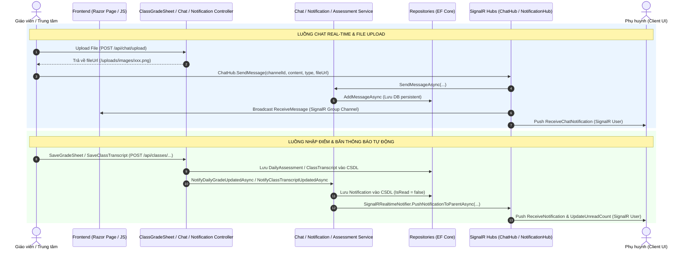

# TÀI LIỆU GIẢI THÍCH CHI TIẾT CODE: CHAT, THÔNG BÁO VÀ BẢNG ĐIỂM

Tài liệu này hệ thống hóa và giải thích chi tiết kiến trúc, luồng nghiệp vụ (Business Logic), các Lớp liên quan (Classes), và danh sách API/SignalR Endpoints của 3 tính năng cốt lõi trong hệ thống EduBridge PRN232:
1. **Module Trò chuyện Real-time (Chat)**
2. **Module Thông báo & Đẩy dữ liệu thời gian thực (Notification)**
3. **Module Quản lý Bảng điểm & Đánh giá (Gradebook / Transcript & Daily Assessment)**

---

## 1. MODULE CHAT (TRÒ CHUYỆN REAL-TIME)

### 1.1 Luồng Nghiệp Vụ (Business Flow)
- **Thiết lập kênh trao đổi (Chat Channel)**: Kênh chat 1:1 được mở giữa **Trung tâm (Center)** và **Phụ huynh (Parent)**. Khi một thành viên truy cập danh sách chat, hệ thống tự động tìm kênh chat sẵn có hoặc khởi tạo kênh mới (`GetOrCreateChannelAsync`).
- **Phân loại nội dung tin nhắn (`MessageType`)**:
  - `Text (0)`: Tin nhắn văn bản thuần túy.
  - `Image (1)`: Tệp hình ảnh (JPG, PNG, GIF, WEBP,...).
  - `Video (2)`: Tệp video (MP4, MOV, AVI, MKV,...).
  - `Document (3)`: Tệp tài liệu (PDF, DOCX, XLSX,...).
- **Quy trình gửi tệp tin đính kèm (File Attachment Flow)**:
  1. Frontend gọi REST API `POST /api/chat/upload` đính kèm tệp tin.
  2. Server kiểm tra định dạng và dung lượng tối đa cho phép (Ảnh: 5MB, Video: 20MB, Document: 10MB).
  3. Server lưu tệp vào thư mục `wwwroot/uploads/{images|videos|docs}/` với tên ngẫu nhiên GUID, trả về `fileUrl` công khai.
  4. Frontend nhận `fileUrl`, sau đó gọi SignalR Hub `ChatHub.SendMessage` truyền `fileUrl`, `messageType` và tên gốc tệp.
- **Truyền tin thời gian thực & Thông báo (Real-time Broadcast & Notification)**:
  - Tất cả client tham gia vào phòng `channelId` (SignalR Group) nhận được thông điệp qua sự kiện `ReceiveMessage` và render ngay lập tức.
  - Phụ huynh/Trung tâm đang ở trang khác ngoài màn hình chat nhận được sự kiện `ReceiveChatNotification` để cập nhật Badge số tin nhắn chưa đọc và hiển thị thông báo Toast pop-up.
- **Trạng thái đọc tin nhắn (Read Status)**:
  - Mỗi khi đối phương tải danh sách tin nhắn của kênh (`GetChannelMessagesAsync`), hệ thống tự động cập nhật `IsRead = true` cho các tin nhắn được gửi từ người kia.

### 1.2 Các Class Liên Quan Theo Kiến Trúc Đa Tầng

#### Layer 1: Domain Entities & Enums
- [ChatChannel.cs](file:///e:/PRN232%20m%E1%BB%9Bi/PRN232_Gr3/src/PROJECT_PRN232_.Domain/ChatChannel.cs): Định nghĩa kênh chat giữa `CenterId` và `ParentId`.
- [ChatMessage.cs](file:///e:/PRN232%20m%E1%BB%9Bi/PRN232_Gr3/src/PROJECT_PRN232_.Domain/ChatMessage.cs): Lưu vết tin nhắn (`ChannelId`, `SenderId`, `MessageContent`, `MessageType`, `FileUrl`, `IsRead`, `SentAt`).
- `MessageType`: Enum phân loại tin nhắn (`Text = 0`, `Image = 1`, `Video = 2`, `Document = 3`).

#### Layer 2: Data Transfer Objects (DTOs)
- `ChatChannelResponseDto`: Trả về thông tin kênh chat, người đối thoại, tin nhắn cuối cùng (`LastMessage`), thời gian gửi và trạng thái đọc.
- `ChatMessageResponseDto`: Trả về chi tiết tin nhắn bao gồm `SenderName`, `MessageType`, `FileUrl`, `IsRead`,...
- `ChatMessageCreateDto`: DTO đầu vào gửi tin nhắn.

#### Layer 3: Persistence Layer (Repositories)
- [IChatRepository.cs](file:///e:/PRN232%20m%E1%BB%9Bi/PRN232_Gr3/src/PROJECT_PRN232_.Application/Repositories/IChatRepository.cs) / [ChatRepository.cs](file:///e:/PRN232%20m%E1%BB%9Bi/PRN232_Gr3/src/PROJECT_PRN232_.Infrastructure/Repositories/ChatRepository.cs):
  - Truy vấn danh sách kênh chat của user theo vai trò Role.
  - Tải danh sách tin nhắn theo kênh, đánh dấu tất cả tin nhắn đối phương gửi là đã đọc.
  - Kiểm tra đếm số tin nhắn chưa đọc (`GetUnreadChatCountAsync`).

#### Layer 4: Application Layer (Services)
- [IChatService.cs](file:///e:/PRN232%20m%E1%BB%9Bi/PRN232_Gr3/src/PROJECT_PRN232_.Application/Services/IChatService.cs) / [ChatService.cs](file:///e:/PRN232%20m%E1%BB%9Bi/PRN232_Gr3/src/PROJECT_PRN232_.Application/Services/ChatService.cs):
  - Xử lý nghiệp vụ kiểm tra thành viên hợp lệ (`IsChannelMemberAsync`).
  - Ánh xạ giữa Entity và DTO, sắp xếp thứ tự tin nhắn theo thời gian gửi.

#### Layer 5: Presentation & Real-time Layer (Controllers, Hub, Clients)
- [ChatHub.cs](file:///e:/PRN232%20m%E1%BB%9Bi/PRN232_Gr3/src/PROJECT_PRN232_.Api/Hubs/ChatHub.cs): SignalR Hub kết nối WebSocket qua endpoint `/hubs/chat`.
- [ChatController.cs](file:///e:/PRN232%20m%E1%BB%9Bi/PRN232_Gr3/src/PROJECT_PRN232_.Api/Controllers/ChatController.cs): REST API xử lý lấy danh sách kênh chat, lịch sử tin nhắn và upload tệp media.
- **Client JS & Razor Pages**:
  - `wwwroot/js/chat-client.js`: Script quản lý kết nối SignalR, gửi/nhận tin nhắn, tải tệp, render tin nhắn dạng văn bản hoặc thẻ media (ảnh/video/file đính kèm).
  - Razor Pages: `Pages/Center/Chat/Index.cshtml`, `Pages/Teacher/Chat/Index.cshtml`, `Pages/Parent/Chat/Index.cshtml`.

### 1.3 Danh Sách API & SignalR Methods Sử Dụng

| Loại | Phương thức / Sự kiện | Endpoint / Name | Mô tả |
| :--- | :--- | :--- | :--- |
| **REST API** | `GET` | `/api/chat/channels` | Lấy danh sách tất cả kênh chat của người dùng hiện tại |
| **REST API** | `GET` | `/api/chat/channels/{channelId}/messages?limit=50` | Lấy lịch sử tin nhắn của kênh & tự động đánh dấu đã đọc |
| **REST API** | `POST` | `/api/chat/upload` | Upload tệp đính kèm (Hình ảnh, Video, Document), trả về `fileUrl` |
| **SignalR Server** | `JoinChannel(channelId)` | `ChatHub` | Tham gia vào SignalR Group của Channel |
| **SignalR Server** | `SendMessage(channelId, content, type, fileUrl)` | `ChatHub` | Gửi tin nhắn real-time tới Channel và lưu Database |
| **SignalR Client Listener** | `ReceiveMessage` | Client JS | Nhận tin nhắn mới trong cửa sổ chat hiện tại |
| **SignalR Client Listener** | `ReceiveChatNotification` | Client JS | Nhận thông báo tin nhắn mới khi đang ở trang khác |

---

## 2. MODULE THÔNG BÁO (NOTIFICATION & REAL-TIME PUSH)

### 2.1 Luồng Nghiệp Vụ (Business Flow)
- **Hệ thống thông báo đa sự kiện (Event-Driven Notifications)**: Hệ thống tự động tạo và gửi thông báo tới Phụ huynh / Giáo viên / Trung tâm khi phát sinh các hành động trong hệ thống:
  - **Điểm danh & Đánh giá bài học**: Giáo viên thực hiện điểm danh hoặc nhập nhận xét buổi học.
  - **Cập nhật Bảng điểm**: Giáo viên/Trung tâm lưu điểm thường xuyên hoặc cập nhật bảng điểm định kỳ (Giữa kỳ/Cuối kỳ).
  - **Xuất bản buổi học (Publish Lesson)**: Trung tâm/Giáo viên công khai bài học kèm danh sách tài liệu và báo cáo tổng hợp.
  - **Quản lý lớp học & Học sinh**: Học sinh được xếp vào lớp, chuyển lớp, rút khỏi lớp, phân công giáo viên hoặc có đơn xin chuyển lớp.
- **Cơ chế lưu trữ và truyền phát kép (Database Persistence + SignalR Push)**:
  1. Thông báo mới được lưu vào bảng `Notifications` trong CSDL với trạng thái `IsRead = false`.
  2. Hệ thống đếm lại số thông báo chưa đọc (`CountUnreadByParentAsync`).
  3. Gọi qua bridge `IRealtimeNotifier` để đẩy thông báo thời gian thực trực tiếp tới user target (`Clients.User(userId)`).
- **Cơ chế tương tác phía Client**:
  - Phụ huynh đăng nhập được tự động nối đến `NotificationHub` (`/hubs/notification`). Khi vừa kết nối (`OnConnectedAsync`), Hub lập tức trả lại số lượng thông báo chưa đọc để hiển thị Badge ở góc trên thanh điều hướng.
  - Khi có thông báo đẩy về, client kích hoạt hiệu ứng Toast và phát âm thanh/hiển thị chấm đỏ.
  - Phụ huynh có thể nhấn Đánh dấu 1 thông báo là đã đọc hoặc Đánh dấu tất cả là đã đọc (`MarkAllRead`).

### 2.2 Các Class Liên Quan Theo Kiến Trúc Đa Tầng

#### Layer 1: Domain Entity
- [Notification.cs](file:///e:/PRN232%20m%E1%BB%9Bi/PRN232_Gr3/src/PROJECT_PRN232_.Domain/Notification.cs): Đại diện cho một bản tin thông báo (`ParentId`, `ClassId`, `Title`, `Message` dạng HTML rich format, `IsRead`, `CreatedAt`).

#### Layer 2: Data Transfer Object (DTO)
- `NotificationResponseDto`: Trả về dữ liệu thông báo cho phía Client UI (`Id`, `ClassId`, `Title`, `Message`, `IsRead`, `CreatedAt`).

#### Layer 3: Persistence Layer (Repositories)
- [INotificationRepository.cs](file:///e:/PRN232%20m%E1%BB%9Bi/PRN232_Gr3/src/PROJECT_PRN232_.Application/Repositories/INotificationRepository.cs) / [NotificationRepository.cs](file:///e:/PRN232%20m%E1%BB%9Bi/PRN232_Gr3/src/PROJECT_PRN232_.Infrastructure/Repositories/NotificationRepository.cs):
  - Thêm thông báo mới (`AddAsync`).
  - Đếm số thông báo chưa đọc (`CountUnreadByParentAsync`).
  - Lấy danh sách N thông báo mới nhất.
  - Cập nhật trạng thái `IsRead = true` (đơn lẻ hoặc hàng loạt).

#### Layer 4: Real-time Bridge & SignalR Hub
- [IRealtimeNotifier.cs](file:///e:/PRN232%20m%E1%BB%9Bi/PRN232_Gr3/src/PROJECT_PRN232_.Application/Services/IRealtimeNotifier.cs): Interface cầu nối decoupled giữa Application Layer và API SignalR Hub.
- [SignalRRealtimeNotifier.cs](file:///e:/PRN232%20m%E1%BB%9Bi/PRN232_Gr3/src/PROJECT_PRN232_.Api/SignalRRealtimeNotifier.cs): Implementation phát sự kiện tới người dùng cụ thể bằng `IHubContext<NotificationHub>`.
- [NotificationHub.cs](file:///e:/PRN232%20m%E1%BB%9Bi/PRN232_Gr3/src/PROJECT_PRN232_.Api/Hubs/NotificationHub.cs): SignalR Hub kết nối WebSocket qua `/hubs/notification`.

#### Layer 5: Application Layer (Services)
- [INotificationService.cs](file:///e:/PRN232%20m%E1%BB%9Bi/PRN232_Gr3/src/PROJECT_PRN232_.Application/Services/INotificationService.cs) / [NotificationService.cs](file:///e:/PRN232%20m%E1%BB%9Bi/PRN232_Gr3/src/PROJECT_PRN232_.Application/Services/NotificationService.cs):
  - Chứa toàn bộ logic dựng nội dung HTML Rich Notification cho từng loại sự kiện: `NotifyRollCallUpdatedAsync`, `NotifyDailyGradeUpdatedAsync`, `NotifyClassTranscriptUpdatedAsync`, `NotifyPublishedLessonAsync`, `NotifyNewMaterialAsync`, `NotifyStudentEnrolledAsync`, `NotifyStudentTransferredAsync`,...

#### Layer 6: Controllers & Frontend Integration
- [NotificationController.cs](file:///e:/PRN232%20m%E1%BB%9Bi/PRN232_Gr3/src/PROJECT_PRN232_.Api/Controllers/NotificationController.cs): REST API lấy thông báo, đánh dấu đã đọc.
- `wwwroot/js/notification-client.js`: Script frontend quản lý nhận dữ liệu SignalR notification real-time.
- `Pages/Shared/_NotificationBadgePartial.cshtml`: UI partial hiển thị chuông thông báo và danh sách dropdown.

### 2.3 Danh Sách API & SignalR Methods Sử Dụng

| Loại | Phương thức / Sự kiện | Endpoint / Name | Mô tả |
| :--- | :--- | :--- | :--- |
| **REST API** | `GET` | `/api/notifications?limit=20` | Lấy danh sách 20 thông báo gần nhất của phụ huynh |
| **REST API** | `PUT` | `/api/notifications/mark-all-read` | Đánh dấu tất cả thông báo của phụ huynh là đã đọc |
| **REST API** | `PUT` | `/api/notifications/{id}/mark-read` | Đánh dấu 1 thông báo cụ thể là đã đọc |
| **SignalR Server Event**| `OnConnectedAsync` | `NotificationHub` | Tự động tính số tin chưa đọc và đẩy `UpdateUnreadCount` khi vừa kết nối |
| **SignalR Client Listener**| `UpdateUnreadCount` | Client JS | Nhận số đếm unread count để render lên Badge chuông |
| **SignalR Client Listener**| `ReceiveNotification` | Client JS | Nhận đối tượng thông báo mới và số đếm unread count mới |

---

## 3. MODULE BẢNG ĐIỂM (GRADEBOOK / TRANSCRIPT & DAILY ASSESSMENT)

### 3.1 Luồng Nghiệp Vụ (Business Flow)
Hệ thống quản lý điểm số được phân định thành **2 cấp độ riêng biệt**:

#### Cấp độ 1: Điểm Đánh Giá Thường Xuyên Theo Buổi Học (Daily Assessment / Grade Sheet)
- **Mục đích**: Ghi nhận kết quả làm bài, phát biểu, kiểm tra nhỏ trong từng buổi học cụ thể của môn học.
- **Thang điểm & Quy tắc**: Điểm số dạng số thập phân từ `0` đến `10` (hỗ trợ 2 chữ số thập phân), kèm theo Lời nhận xét (Comment) của giáo viên.
- **Quy trình lưu điểm**:
  1. Giáo viên mở trang `GradeSheet` của buổi học (`/Teacher/Lessons/GradeSheet?lessonId=...` hoặc `ClassGradeSheet`).
  2. Nhập điểm và nhận xét cho các học sinh.
  3. Gửi dữ liệu về Controller (`SaveGradeSheet`).
  4. Hệ thống cập nhật bảng `DailyAssessments` (tạo mới nếu chưa có, sửa đổi nếu đã tồn tại).
  5. Tự động gọi `_notificationService.NotifyDailyGradeUpdatedAsync` phát thông báo tới Phụ huynh học sinh tương ứng.

#### Cấp độ 2: Bảng Điểm Tổng Kết Môn / Lớp Học (Class Transcript)
- **Mục đích**: Tổng hợp toàn bộ quá trình học tập của học sinh trong một khóa/lớp học.
- **Các thành phần điểm & Công thức tính**:
  1. **Điểm Trung Bình Thường Xuyên (`AverageDailyScore` - Tỷ trọng 30%)**: Tự động tính toán bằng trung bình cộng tất cả các đầu điểm `DailyAssessment` có trong lớp học của học sinh đó.
  2. **Điểm Giữa Kỳ (`MidTermScore` - Tỷ trọng 30%)**: Nhập tay trực tiếp kèm lời nhận xét `MidTermComment`.
  3. **Điểm Cuối Kỳ (`FinalScore` - Tỷ trọng 40%)**: Nhập tay trực tiếp kèm lời nhận xét `FinalComment`.
  4. **Điểm Tổng Kết Toàn Khóa (`FinalScoreTotal`)**:
     $$\text{FinalScoreTotal} = (\text{AverageDailyScore} \times 0.3) + (\text{MidTermScore} \times 0.3) + (\text{FinalScore} \times 0.4)$$
     *(Công thức tự động kích hoạt khi học sinh đã có đầy đủ 3 đầu điểm trên).*
- **Quy trình lưu và gửi báo cáo**:
  1. Giáo viên/Trung tâm lưu bảng điểm tổng kết tại API `SaveClassTranscript`.
  2. Cập nhật dữ liệu vào bảng `ClassTranscripts`.
  3. Kích hoạt thông báo `NotifyClassTranscriptUpdatedAsync` đẩy kết quả tổng kết lên ứng dụng Phụ huynh.

### 3.2 Các Class Liên Quan Theo Kiến Trúc Đa Tầng

#### Layer 1: Domain Entities
- [DailyAssessment.cs](file:///e:/PRN232%20m%E1%BB%9Bi/PRN232_Gr3/src/PROJECT_PRN232_.Domain/DailyAssessment.cs): Bản ghi điểm thường xuyên (`StudentId`, `LessonId`, `Score`, `Comment`, `DateAssessed`).
- [ClassTranscript.cs](file:///e:/PRN232%20m%E1%BB%9Bi/PRN232_Gr3/src/PROJECT_PRN232_.Domain/ClassTranscript.cs): Bản ghi bảng điểm tổng kết (`ClassId`, `StudentId`, `MidTermScore`, `MidTermComment`, `FinalScore`, `FinalComment`, `AverageDailyScore`, `FinalScoreTotal`).

#### Layer 2: Data Transfer Objects (DTOs)
- `GradeEntryDto`: DTO nhận dữ liệu điểm thường xuyên từng buổi (`StudentId`, `LessonId`, `Score`, `TeacherComment`).
- `TranscriptEntryDto`: DTO nhận dữ liệu điểm tổng kết (`StudentId`, `MidTermScore`, `MidTermComment`, `FinalScore`, `FinalComment`).
- `LessonAssessmentBulkDto` / `AssessmentUpsertDto` / `AssessmentResponseDto`: DTO phục vụ REST API quản lý đánh giá bài học.

#### Layer 3: Persistence Layer (Repositories)
- [IDailyAssessmentRepository.cs](file:///e:/PRN232%20m%E1%BB%9Bi/PRN232_Gr3/src/PROJECT_PRN232_.Application/Repositories/IDailyAssessmentRepository.cs) / [DailyAssessmentRepository.cs](file:///e:/PRN232%20m%E1%BB%9Bi/PRN232_Gr3/src/PROJECT_PRN232_.Infrastructure/Repositories/DailyAssessmentRepository.cs): Thao tác CSDL với điểm hàng ngày.
- [IClassTranscriptRepository.cs](file:///e:/PRN232%20m%E1%BB%9Bi/PRN232_Gr3/src/PROJECT_PRN232_.Application/Repositories/IClassTranscriptRepository.cs) / [ClassTranscriptRepository.cs](file:///e:/PRN232%20m%E1%BB%9Bi/PRN232_Gr3/src/PROJECT_PRN232_.Infrastructure/Repositories/ClassTranscriptRepository.cs): Thao tác CSDL với bảng điểm tổng kết.

#### Layer 4: Application Layer (Services)
- [IAssessmentService.cs](file:///e:/PRN232%20m%E1%BB%9Bi/PRN232_Gr3/src/PROJECT_PRN232_.Application/Services/IAssessmentService.cs) / [AssessmentService.cs](file:///e:/PRN232%20m%E1%BB%9Bi/PRN232_Gr3/src/PROJECT_PRN232_.Application/Services/AssessmentService.cs): Xử lý các logic chấm điểm hàng loạt, lọc điểm theo phụ huynh.

#### Layer 5: Controllers & WebApp Handlers
- [ClassGradeSheetController.cs](file:///e:/PRN232%20m%E1%BB%9Bi/PRN232_Gr3/src/PROJECT_PRN232_.WebApp/Controllers/ClassGradeSheetController.cs): API Controller chính của WebApp xử lý lưu điểm thường xuyên (`/api/classes/{classId}/gradesheet`) và lưu bảng điểm tổng kết (`/api/classes/{classId}/transcript`).
- [AssessmentController.cs](file:///e:/PRN232%20m%E1%BB%9Bi/PRN232_Gr3/src/PROJECT_PRN232_.Api/Controllers/AssessmentController.cs): API Controller phục vụ REST cho Mobile/External Clients.

#### Layer 6: Frontend & UI Components
- `wwwroot/js/gradesheet.js`: Script xử lý tương tác UI nhập điểm thường xuyên, kiểm tra dữ liệu đầu vào (0-10) và submit AJAX.
- **Razor Pages**:
  - `Pages/Teacher/Lessons/GradeSheet.cshtml` & `GradeSheet.cshtml.cs`: Màn hình giáo viên chấm điểm cho 1 buổi học.
  - `Pages/Teacher/Lessons/ClassGradeSheet.cshtml` & `ClassGradeSheet.cshtml.cs`: Màn hình xem ma trận điểm thường xuyên toàn bộ các buổi học trong lớp.
  - `Pages/Teacher/Lessons/ClassTranscript.cshtml` & `ClassTranscript.cshtml.cs`: Màn hình nhập điểm Giữa kỳ, Cuối kỳ và xem Điểm trung bình / Tổng kết lớp.

### 3.3 Danh Sách API Sử Dụng

| Loại | Phương thức | Endpoint | Mô tả |
| :--- | :--- | :--- | :--- |
| **WebApp Controller API** | `POST` | `/api/classes/{classId}/gradesheet` | Lưu danh sách điểm thường xuyên (Daily Assessment) theo buổi học |
| **WebApp Controller API** | `POST` | `/api/classes/{classId}/transcript` | Lưu điểm Giữa kỳ & Cuối kỳ, tự động tính TB Thường xuyên và Tổng kết |
| **REST API** | `GET` | `/api/lessons/{lessonId}/assessment` | Lấy danh sách điểm và nhận xét của một buổi học |
| **REST API** | `PUT` | `/api/lessons/{lessonId}/assessment` | Lưu điểm và nhận xét buổi học dạng Bulk (Center Role) |
| **REST API** | `GET` | `/api/parent/children/{studentId}/assessment` | Phụ huynh xem toàn bộ lịch sử điểm số và nhận xét của con |

---

## 4. TỔNG HỢP SƠ ĐỒ LUỒNG TƯƠNG TÁC (ARCHITECTURE DIAGRAM)

---
*Tài liệu được khởi tạo tự động dựa trên cấu trúc nguồn dự án PRN232_Gr3.*
