# System Sequence Diagrams & Detailed Explanations - PRN232_Gr3

> **Ghi chú chuẩn hóa Visual Paradigm:**
> Tất cả 13 biểu đồ dưới đây được thiết kế theo chuẩn **Visual Paradigm UML Sequence Diagram (Mô hình ECB)**:
> - **Cơ chế Hộp thư liên hệ & Tự động tạo Kênh Chat**:
>   - Ngay khi tài khoản **Phụ huynh (Parent)** hoặc **Giáo viên (Teacher)** được khởi tạo trong hệ thống, Admin/Center sẽ thấy họ trong danh sách "Hộp thư liên hệ" (có 2 tab Phụ huynh & Giáo viên).
>   - Khi Admin/Center click vào bất kỳ Phụ huynh hoặc Giáo viên nào, hệ thống gọi `GetOrCreateChannelAsync`: Nếu chưa có phòng chat $\rightarrow$ Tự động khởi tạo `ChatChannel` mới để sẵn sàng nhắn tin ngay lập tức.
> - **Quy tắc phân quyền Chat (Chat Matrix)**:
>   - ✅ **Admin (Center) $\leftrightarrow$ Phụ huynh (Parent)**: ĐƯỢC PHÉP.
>   - ✅ **Admin (Center) $\leftrightarrow$ Giáo viên (Teacher)**: ĐƯỢC PHÉP.
>   - ❌ **Giáo viên (Teacher) $\leftrightarrow$ Phụ huynh (Parent)**: KHÔNG CHO PHÉP (Hệ thống ngăn cấm giao tiếp trực tiếp).
> - **Phân quyền Đọc Thông Báo**: API Notification (`NotificationController`) hỗ trợ cả **3 Vai Trò (Parent, Center, Teacher)** đọc và đánh dấu thông báo cá nhân là đã đọc.
> - **Nhập Bảng Điểm Định Kỳ (Giữa Kỳ / Cuối Kỳ)**: Do **Giáo viên (`Teacher`)** phụ trách giảng dạy lớp học thực hiện nhập điểm Giữa kỳ (30%), Cuối kỳ (40%) và nhận xét định kỳ.
> - **Ngôn ngữ**: Nội dung mô tả & hành động bằng **Tiếng Việt**, tên hàm C#, câu lệnh SQL, mã HTTP và DTO giữ nguyên **Tiếng Anh**.
> - **Nguyên tắc luồng**: Bắt đầu từ **Actor** tác động vào **View** và **kết thúc phản hồi về chính Actor**.
> - **Ký hiệu thành phần**: `actor` (Hình người), `boundary` (Màn hình/UI), `control` (Xử lý/Controller/Service), `entity` (Kho dữ liệu/Repository), `database` (Cơ sở dữ liệu).

---

## 📋 MỤC LỤC

1. [Phân Hệ Chat (5 Sơ đồ & Giải thích)](#1-phân-hệ-chat)
   - [1.1. Khởi Tạo / Lấy Kênh Chat Khi Bấm Chọn Liên Hệ](#11-khởi-tạo--lấy-kênh-chat-khi-bấm-chọn-liên-hệ)
   - [1.2. Kết Nối SignalR ChatHub & Gia Nhập Channel](#12-kết-nối-signalr-chathub--gia-nhập-channel)
   - [1.3. Gửi Tin Nhắn Văn Bản (Text Message)](#13-gửi-tin-nhắn-văn-bản-text-message)
   - [1.4. Upload File Học Liệu/Ảnh/Video & Gửi Qua SignalR](#14-upload-file-học-liệuảnhvideo--gửi-qua-signalr)
   - [1.5. Xem Danh Sách Channel & Đánh Dấu Tự Động Đã Đọc](#15-xem-danh-sách-channel--đánh-dấu-tự-động-đã-đọc)
2. [Phân Hệ Thông Báo (5 Sơ đồ & Giải thích)](#2-phân-hệ-thông-báo)
   - [2.1. Kết Nối NotificationHub & Lấy Số Thông Báo Chưa Đọc](#21-kết-nối-notificationhub--lấy-số-thông-báo-chưa-đọc)
   - [2.2. Thông Báo Điểm Danh & Nhận Xét Bài Học](#22-thông-báo-điểm-danh--nhận-xét-bài-học)
   - [2.3. Xuất Bản Buổi Học & Gửi Báo Cáo Tổng Hợp](#23-xuất-bản-buổi-học--gửi-báo-cáo-tổng-hợp)
   - [2.4. Thông Báo Xếp Lớp & Chuyển Lớp Cho Phụ Huynh](#24-thông-báo-xếp-lớp--chuyển-lớp-cho-phụ-huynh)
   - [2.5. Đọc Thông Báo & Đánh Dấu Đã Đọc](#25-đọc-thông-báo--đánh-dấu-đã-đọc)
3. [Phân Hệ Quản Lý Bảng Điểm & Điểm Danh (3 Sơ đồ & Giải thích)](#3-phân-hệ-quản-lý-bảng-điểm--điểm-danh)
   - [3.1. Giáo Viên Thực Hiện Điểm Danh & Nhập Điểm Buổi Học](#31-giáo-viên-thực-hiện-điểm-danh--nhập-điểm-buổi-học)
   - [3.2. Giáo Viên Cập Nhật Bảng Điểm Định Kỳ Giữa Kỳ & Cuối Kỳ](#32-giáo-viên-cập-nhật-bảng-điểm-định-kỳ-giữa-kỳ--cuối-kỳ)
   - [3.3. Phụ Huynh Tra Cứu Kết Quả Học Tập & Bảng Điểm Con](#33-phụ-huynh-tra-cứu-kết-quả-học-tập--bảng-điểm-con)

---

## 1. PHÂN HỆ CHAT

### 1.1. Khởi Tạo / Lấy Kênh Chat Khi Bấm Chọn Liên Hệ (Hộp Thư Liên Hệ)

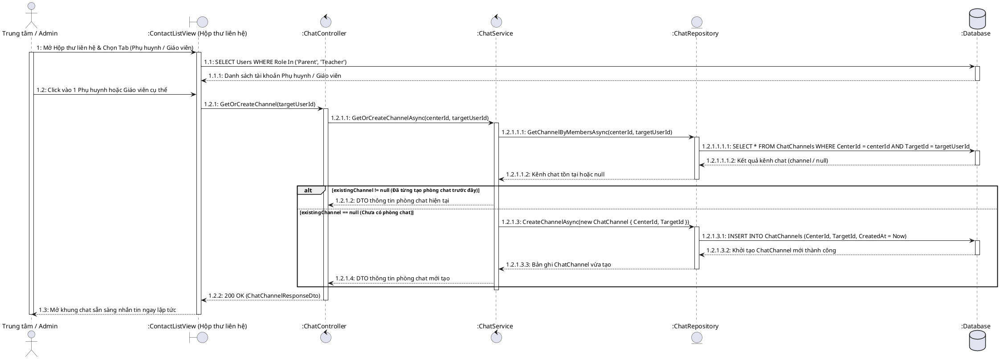

#### 📖 Giải Thích Ý Nghĩa Sơ Đồ 1.1:
- **Mục đích**: Giải thích chính xác luồng trên giao diện **Hộp thư liên hệ**: Khi tài khoản Phụ huynh hoặc Giáo viên vừa được đăng ký/khởi tạo trong hệ thống, Admin sẽ nhìn thấy họ trên danh sách danh bạ "Hộp thư liên hệ". Khi Admin bấm chọn vào bất kỳ ai, hệ thống tự động kiểm tra xem 2 người đã từng nhắn tin chưa (`GetChannelByMembersAsync`). Nếu chưa từng nhắn tin, hệ thống tự động INSERT một bản ghi phòng chat mới (`CreateChannelAsync`) trong CSDL và bật màn hình chat lên để nhắn tin ngay.

---

### 1.2. Kết Nối SignalR ChatHub & Gia Nhập Channel

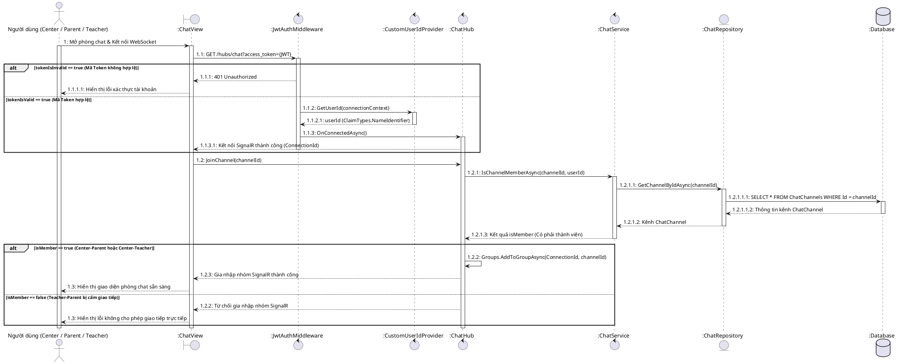

#### 📖 Giải Thích Ý Nghĩa Sơ Đồ 1.2:
- **Mục đích**: Xác thực kết nối WebSocket real-time qua JWT Token và phân quyền tham gia phòng chat. Hệ thống kiểm tra xem `userId` có phải là thành viên hợp lệ của phòng chat (`Center-Parent` hoặc `Center-Teacher`). Nếu là cặp `Teacher-Parent` tương tác trực tiếp, hệ thống sẽ ngăn cấm không cho gia nhập nhóm.

---

### 1.3. Gửi Tin Nhắn Văn Bản (Text Message)

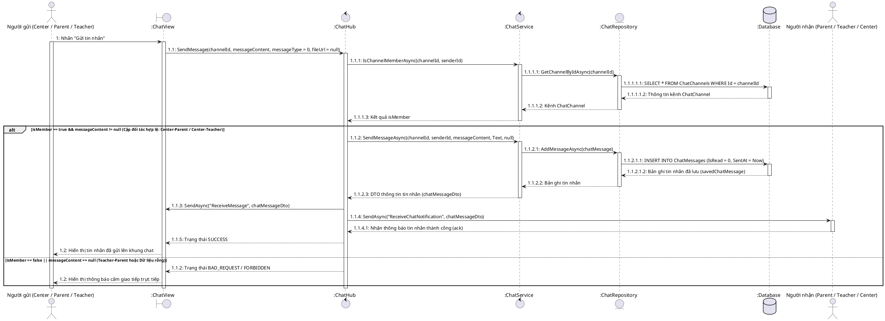

#### 📖 Giải Thích Ý Nghĩa Sơ Đồ 1.3:
- **Mục đích**: Xử lý việc gửi tin nhắn text, lưu trữ vào bảng `ChatMessages` với `IsRead = 0` và phát thông điệp tức thì qua 2 luồng: `ReceiveMessage` cho phòng chat hiện tại và `ReceiveChatNotification` để nổ Toast thông báo trên thiết bị của người nhận.

---

### 1.4. Upload File Học Liệu/Ảnh/Video & Gửi Qua SignalR

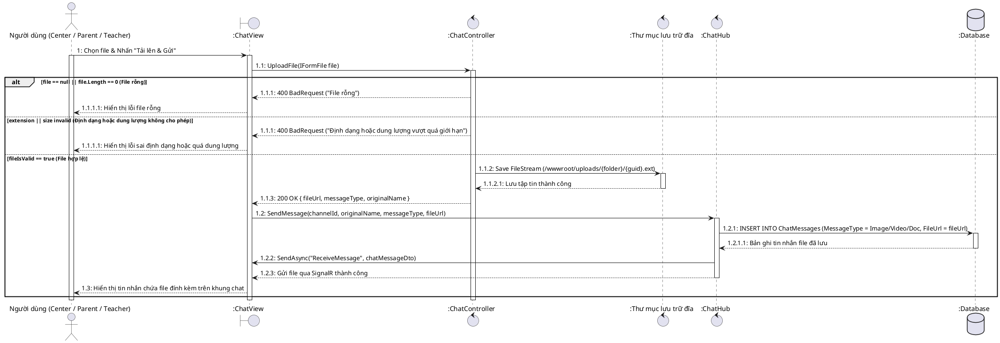

#### 📖 Giải Thích Ý Nghĩa Sơ Đồ 1.4:
- **Mục đích**: Upload file phương tiện (Ảnh <= 5MB, Tài liệu <= 10MB, Video <= 20MB) lên thư mục server vật lý qua REST API HTTP trước để tối ưu hiệu năng băng thông WebSocket, sau đó mới gửi tin nhắn chứa đường dẫn file qua SignalR Hub.

---

### 1.5. Xem Danh Sách Channel & Đánh Dấu Tự Động Đã Đọc

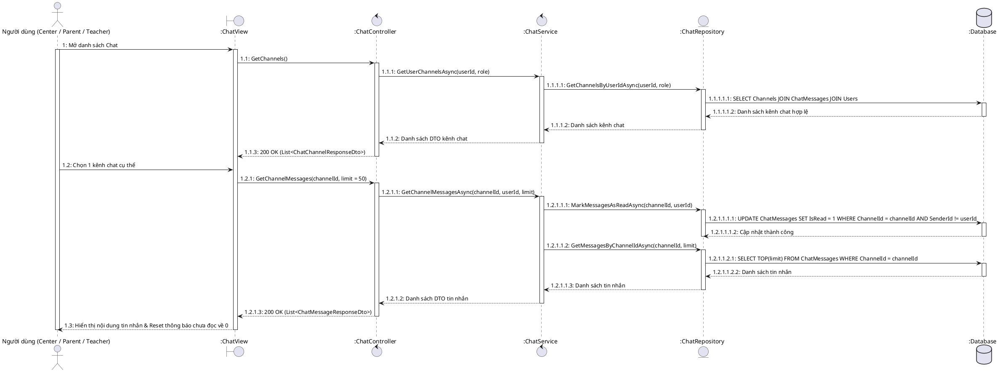

#### 📖 Giải Thích Ý Nghĩa Sơ Đồ 1.5:
- **Mục đích**: Lấy danh sách hội thoại của người dùng và tự động chạy lệnh UPDATE `IsRead = 1` đối với tất cả các tin nhắn đối phương gửi ngay thời điểm người dùng nhấn chọn mở xem kênh chat đó.

---

## 2. PHÂN HỆ THÔNG BÁO

### 2.1. Kết Nối NotificationHub & Lấy Số Thông Báo Chưa Đọc

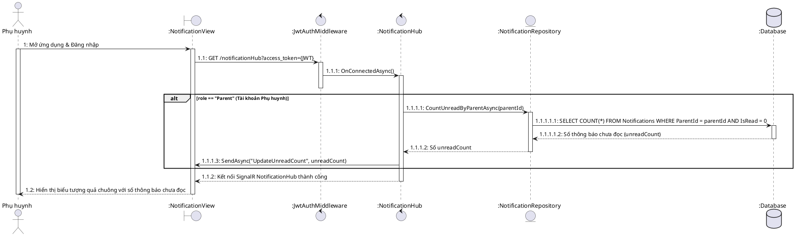

#### 📖 Giải Thích Ý Nghĩa Sơ Đồ 2.1:
- **Mục đích**: Khi Phụ huynh vừa mở app hoặc đăng nhập, kết nối WebSocket NotificationHub được thiết lập. Hệ thống tự động đếm con số thông báo chưa đọc (`IsRead = 0`) trong CSDL và phát lệnh `UpdateUnreadCount` để cập nhật biểu tượng quả chuông màu đỏ trên giao diện ứng dụng.

---

### 2.2. Thông Báo Điểm Danh & Nhận Xét Bài Học (RollCall Notification)

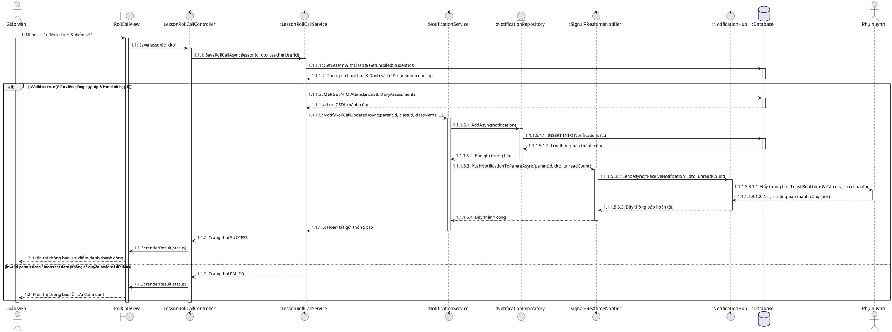

#### 📖 Giải Thích Ý Nghĩa Sơ Đồ 2.2:
- **Mục đích**: Ngay sau khi Giáo viên lưu điểm danh hoặc nhập điểm bài học, `NotificationService` xây dựng thông báo định dạng HTML đẹp mắt (chứa badge Có mặt/Vắng mặt, điểm số và lời nhận xét) $\rightarrow$ Lưu vào bảng `Notifications` $\rightarrow$ Phát sự kiện `ReceiveNotification` để đẩy Toast thông báo trực tiếp đến Phụ huynh của từng học sinh.

---

### 2.3. Xuất Bản Buổi Học & Gửi Báo Cáo Tổng Hợp (Publish Lesson Report)

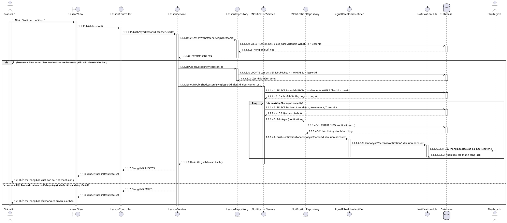

#### 📖 Giải Thích Ý Nghĩa Sơ Đồ 2.3:
- **Mục đích**: Cho phép Giáo viên nhấn "Xuất bản buổi học" (`IsPublished = 1`). Hệ thống tự động gom dữ liệu chuyên cần, điểm thường xuyên của buổi học, điểm tổng kết định kỳ (`ClassTranscript`) và danh sách bài giảng/slide `Materials` để gửi bản báo cáo tổng hợp chất lượng buổi học tới tất cả Phụ huynh trong lớp.

---

### 2.4. Thông Báo Xếp Lớp & Chuyển Lớp Cho Phụ Huynh

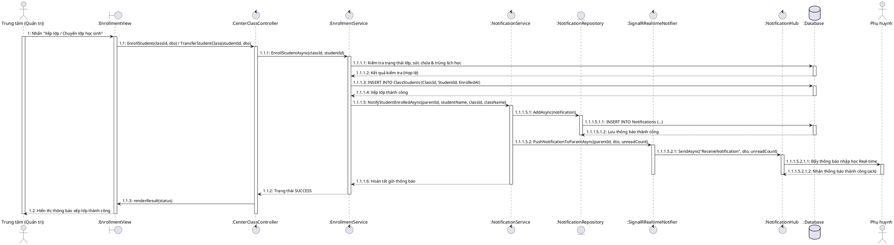

#### 📖 Giải Thích Ý Nghĩa Sơ Đồ 2.4:
- **Mục đích**: Khi Quản trị viên Trung tâm thực hiện xếp lớp (`EnrollStudentAsync`) hoặc chuyển lớp (`TransferStudentClassAsync`) cho học sinh, hệ thống sẽ tự động sinh thông báo báo thông thông tin lớp mới và đẩy thông báo real-time tới Phụ huynh của học sinh đó.

---

### 2.5. Đọc Thông Báo & Đánh Dấu Đã Đọc (Dành Cho 3 Vai Trò: Parent, Center, Teacher)

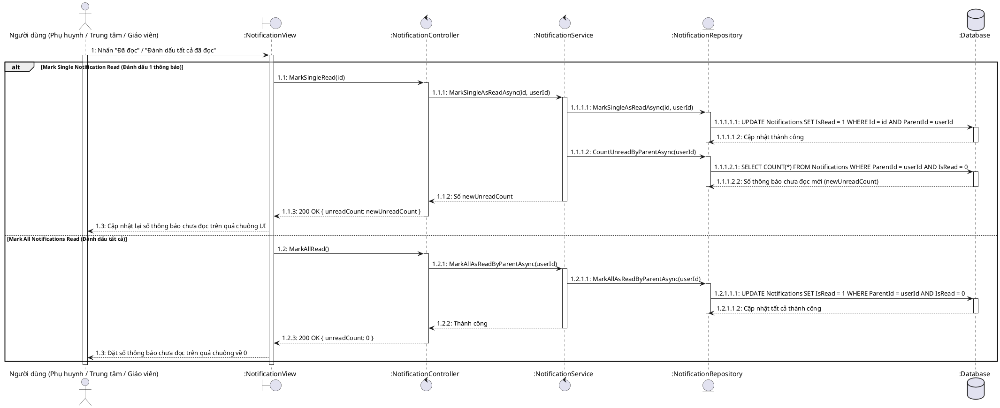

#### 📖 Giải Thích Ý Nghĩa Sơ Đồ 2.5:
- **Mục đích & Phân quyền 3 Vai Trò**: API `NotificationController` áp dụng thuộc tính `[Authorize(Roles = "Parent,Center,Teacher")]`. Điều này có nghĩa là cả **3 Vai Trò (Phụ huynh, Trung tâm, Giáo viên)** đều có thể sử dụng màn hình này để xem danh sách thông báo của chính mình và cập nhật trạng thái đã đọc (`IsRead = 1`), giúp giao diện tự động trừ số lượng quả chuông màu đỏ về 0.

---

## 3. PHÂN HỆ QUẢN LÝ BẢNG ĐIỂM & ĐIỂM DANH

### 3.1. Giáo Viên Thực Hiện Điểm Danh & Nhập Điểm Buổi Học

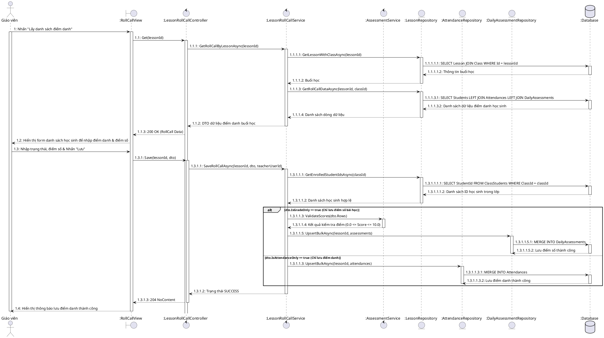

#### 📖 Giải Thích Ý Nghĩa Sơ Đồ 3.1:
- **Mục đích**: Mô tả 2 giai đoạn làm việc của Giáo viên:
  1. Giai đoạn 1 (`GET`): Lấy danh sách điểm danh và điểm số bài học hiện có của lớp.
  2. Giai đoạn 2 (`PUT`): Nhập trạng thái chuyên cần (Có mặt, Vắng mặt, Đi muộn), nhập điểm số bài học (kiểm tra `0.0 <= Score <= 10.0`) và chạy thủ tục `MERGE` lưu vào CSDL hàng loạt.

---

### 3.2. Giáo Viên Cập Nhật Bảng Điểm Định Kỳ Giữa Kỳ & Cuối Kỳ (Transcript Report)

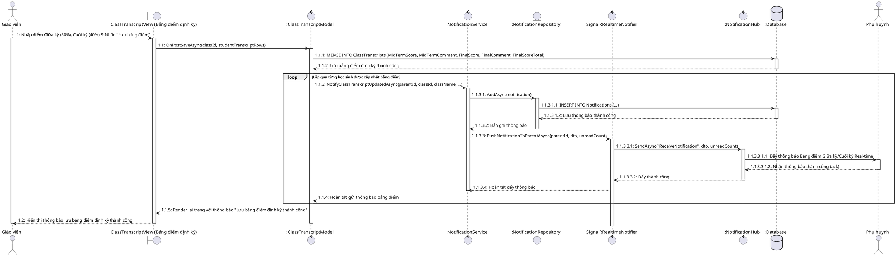

#### 📖 Giải Thích Ý Nghĩa Sơ Đồ 3.2:
- **Mục đích (Khớp 100% với giao diện màn hình Giáo viên nhập bảng điểm định kỳ)**:
  - **Màn hình**: `Pages/Teacher/Lessons/ClassTranscript.cshtml` (*Bảng điểm định kỳ Giữa kỳ / Cuối kỳ*).
  - **Actor**: **Giáo viên (`Teacher`)** phụ trách giảng dạy lớp học.
  - **Quy trình**: Giáo viên nhập điểm Giữa kỳ (hệ số 30%), Nhận xét Giữa kỳ, Điểm Cuối kỳ (hệ số 40%), Nhận xét Cuối kỳ $\rightarrow$ Bấm nút "Lưu bảng điểm" $\rightarrow$ Hệ thống tính Điểm Tổng kết (`0.3 * TX + 0.3 * GK + 0.4 * CK`), lưu vào bảng `ClassTranscripts` trong CSDL $\rightarrow$ Tự động sinh thông báo và bắn thông báo real-time trực tiếp đến Phụ huynh của từng học sinh trong lớp.

---

### 3.3. Phụ Huynh Tra Cứu Kết Quả Học Tập & Bảng Điểm Con (Security & IsPublished Filter)

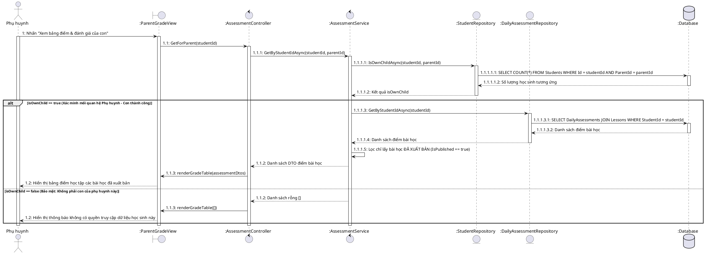

#### 📖 Giải Thích Ý Nghĩa Sơ Đồ 3.3:
- **Mục đích**: Xử lý việc Phụ huynh xem điểm và nhận xét của con mình.
- **Cơ chế bảo mật**:
  - `IsOwnChildAsync`: Kiểm tra xem học sinh `studentId` có đúng là con của Phụ huynh `parentId` đang đăng nhập hay không để ngăn chặn việc xem trộm điểm học sinh khác.
  - Bộ lọc `IsPublished == true`: Chỉ hiển thị điểm bài học đã được Giáo viên bấm **Xuất bản bài học**.
